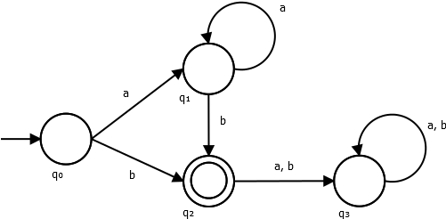

# automata-theory
Code samples for automata

## dfa1

- Regular expression accepted: `a*b`
- States ` Q = {q0, q1, q2, q3}`
- Acception states `F = {q2}`
- Alphabet `$\Sigma$ = {a, b}`
- Delta function: `$Q x \Sigma$`

